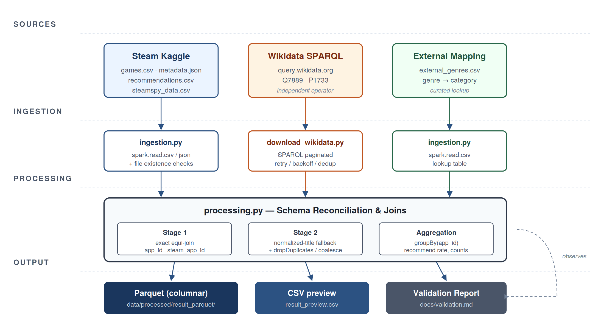

# Steam Cross-Source Analytics Pipeline

A Spark pipeline that joins **41 million Steam reviews** with an **independent Wikidata knowledge base** and produces a verified per-game analytics table — in **121 seconds** on a single laptop.



## What it does, in one paragraph

Loads the 2 GB Steam Kaggle dataset (50,872 games, 41M reviews) plus 9,255 Wikidata entities fetched live via SPARQL. Reconciles the two schemas through a **two-stage entity resolution** (exact `app_id` match, then normalized-title fallback). Aggregates to **37,610 games** with Steam recommendation rates joined against Wikidata-curated publisher, country, and release date. Writes columnar Parquet output natively through Spark and emits a Markdown data-quality report on every run.

## Quick stats

| | |
|---|---|
| **Records processed** | 41,154,794 reviews |
| **Output** | 37,610 games, one row each |
| **Cross-source match rate** | 10.1% (3,799 of 37,610 resolved to Wikidata) |
| **Runtime** | 120.9 s end-to-end |
| **Throughput** | ≈ 340,000 rows/sec |
| **Null rate (critical columns)** | 0.00% |

## Stack

PySpark 3.5 · Wikidata SPARQL · SteamSpy API · PyYAML · pytest · Python 3.10+

## Run it

```bash
git clone <this-repo-url>
cd project_m4_code
python -m venv .venv && .venv/Scripts/activate    # Windows; use source .venv/bin/activate on macOS/Linux
pip install -r requirements.txt

# Drop the Steam Kaggle files into data/raw/, then:
python -m src.ingestion.download_wikidata          # fetch the second source (~1 min)
python -m src.main                                 # run the pipeline (~2 min)
```

Output appears in `data/processed/result_parquet/`. Validation report regenerates at `docs/validation.md`.

---

## More detail

<details>
<summary><b>Repository layout</b></summary>

```
project_m4_code/
├── README.md                   # this file
├── LICENSE                     # MIT
├── requirements.txt            # pinned dependencies
├── .env.example                # template for any future credentials
├── .gitignore
├── config/
│   └── settings.yaml           # all tunables: paths, retry policies, validation thresholds
├── src/
│   ├── ingestion/              # Steam files + Wikidata SPARQL acquisition
│   ├── processing/             # cleaning, joins, entity resolution, validation
│   ├── storage/                # Parquet + CSV writers
│   ├── utils/                  # logger, config loader
│   └── main.py                 # entry point
├── data/
│   ├── raw/                    # (gitignored) put input files here
│   ├── processed/              # (gitignored) Parquet + CSV preview
│   └── sample/                 # tiny example data committed
├── doc/
│   ├── architecture.md         # technical design walkthrough
│   ├── architecture.png        # diagram
│   ├── data_dictionary.md      # column-by-column schema reference
│   └── validation.md           # auto-generated data-quality report
└── tests/
    └── test_smoke.py           # config + import sanity checks
```
</details>

<details>
<summary><b>Prerequisites</b></summary>

* Python 3.10+ (tested on 3.12)
* Java 17 (Spark dependency — install Eclipse Temurin)
* Windows users: install `winutils.exe` and set `HADOOP_HOME` so Spark can write Parquet
* ~3 GB free disk for raw inputs; ~10 GB free if you run the full pipeline (Spark scratch space)
</details>

<details>
<summary><b>Data sources</b></summary>

| File | Source | Size | How to get it |
|---|---|---|---|
| `games.csv` | Kaggle | ~5 MB | <https://www.kaggle.com/datasets/antonkozyriev/game-recommendations-on-steam> |
| `games_metadata.json` | Kaggle | ~18 MB | (same Kaggle dataset) |
| `recommendations.csv` | Kaggle | ~2 GB | (same Kaggle dataset) |
| `steamspy_data.csv` | SteamSpy API | ~10 KB | `python -m src.ingestion.download_steamspy` |
| `external_genres.csv` | curated | <1 KB | already in `data/sample/`; copy to `data/raw/` |
| `wikidata_games.json` | Wikidata SPARQL | ~2 MB | `python -m src.ingestion.download_wikidata` |
</details>

<details>
<summary><b>Usage examples</b></summary>

Read the Parquet output back into Spark:

```python
from pyspark.sql import SparkSession
spark = SparkSession.builder.getOrCreate()
df = spark.read.parquet("data/processed/result_parquet")
df.show(10)
```

Find the most-recommended Steam games published in Japan — a question the Steam-only Kaggle dataset cannot answer alone:

```python
from pyspark.sql.functions import col
(df.filter(col("wd_country") == "Japan")
   .filter(col("num_reviews") > 1000)
   .orderBy(col("steam_recommend_rate").desc())
   .select("title", "steam_recommend_rate", "num_reviews", "wd_publisher")
   .show(10, truncate=False))
```

Refresh the Wikidata cache:

```bash
python -m src.ingestion.download_wikidata
```
</details>

<details>
<summary><b>Output schema</b></summary>

One row per Steam game in `data/processed/result_parquet/`:

* **Steam metrics**: `app_id`, `steam_recommend_rate`, `num_reviews`, `num_positive_reviews`
* **Descriptive**: `title`, `primary_tag`, `genre_category`, `price`
* **Wikidata-sourced**: `wikidata_qid`, `wd_release_date`, `wd_metacritic`, `wd_publisher`, `wd_country`

See [`docs/data_dictionary.md`](docs/data_dictionary.md) for full column-by-column documentation.
</details>

<details>
<summary><b>Project status & known limitations</b></summary>

**Complete.** All M4 deliverables are in place.

Limitations:
* Single-node Spark only — has not been tested on a real cluster.
* The 10.1% Wikidata match rate is bounded by Wikidata's coverage of Steam, not by the join logic itself; long-tail / indie titles do not have Wikidata entries yet.
* Wikidata ingestion is a manual step rather than a scheduled refresh. Future work would orchestrate this through Airflow or Prefect.
</details>

---

**License**: MIT — see [LICENSE](LICENSE)

**Author**: Keyan Luo (kluo2@students.kennesaw.edu) — Kennesaw State University, CS 4265 Big Data Analytics, Spring 2026

Built on the Steam reviews dataset by Anton Kozyriev (Kaggle), the SteamSpy public API by Sergey Galyonkin, and the Wikidata knowledge base by the Wikimedia Foundation.
